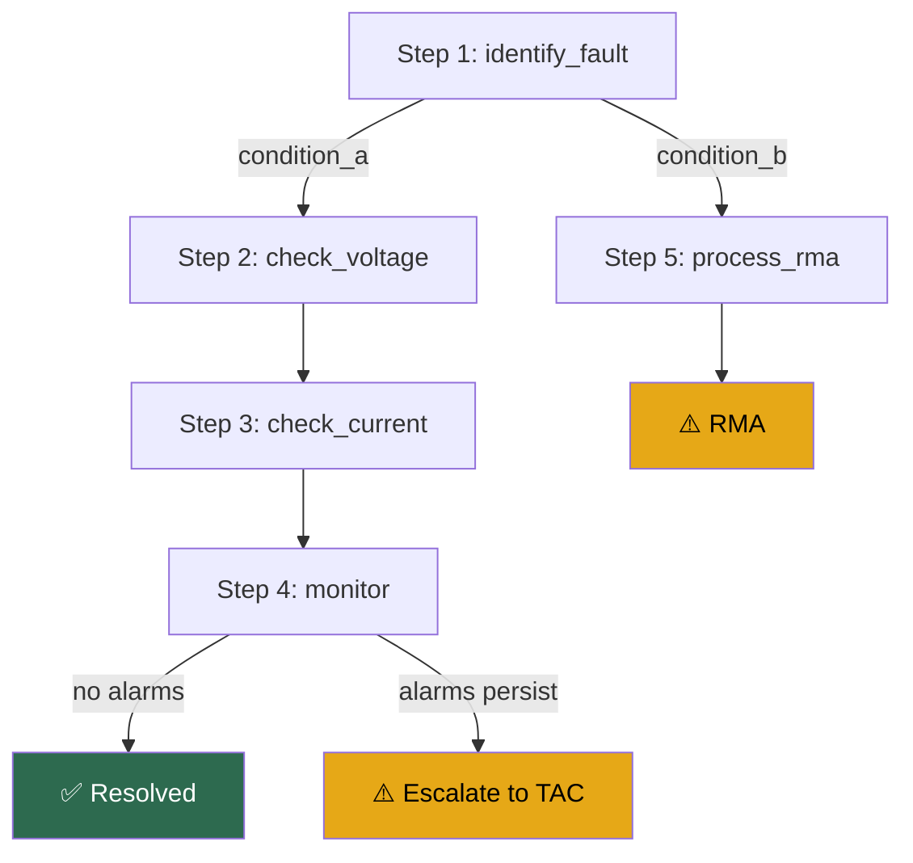

# Repair Action Workflow Schema Reference

This document defines the complete schema for **Repair Action Workflow** (RAW)
YAML artifacts. RAWs provide structured, ordered diagnosis and repair procedures
for known fault conditions, supporting both automated execution and manual
rendering as remediation guides.

## Document Structure

```yaml
workflow:                         # Required — top-level wrapper
  metadata:                       #   identification
    name: ...
    ...
  inputs: [...]                   #   variables from fault signature
  action_groups: [...]            #   reusable action sequences
  steps: [...]                    #   ordered workflow steps
```

---

## Top-Level Fields

| Field | Type | Required | Description |
|---|---|---|---|
| `workflow` | object | Yes | Top-level wrapper containing all workflow content |

---

## `workflow` Object

| Field | Type | Required | Description |
|---|---|---|---|
| `metadata` | object | Yes | Workflow identification and classification |
| `inputs` | array | No | Input variables provided by the fault management system |
| `action_groups` | array | No | Reusable action group sequences (can be empty `[]`) |
| `steps` | array | Yes | Ordered sequence of workflow steps. Min 1 item |

---

## `workflow.metadata` Object

| Field | Type | Required | Description |
|---|---|---|---|
| `name` | string | Yes | Unique identifier. **UPPERCASE_SNAKE_CASE** with `_REPAIR` suffix. Pattern: `^[A-Z][A-Z0-9_]+_REPAIR$` |
| `id` | string | Yes | Unique string ID. Pattern: **`RAW######`** (6-digit zero-padded, e.g., `"RAW000004"`). Shares the 6-digit suffix with its Alert Definition, FS, and RG |
| `alert_def_id` | string | No | ID of the parent Alert Definition. Pattern: **`AD######`** (e.g., `"AD000004"`). Omit only when the workflow is shared across multiple Alert Definitions |
| `version` | string | Yes | Semantic version: `MAJOR.MINOR.PATCH` (e.g., `"1.0.0"`) |
| `description` | string | Yes | Multi-line explanation of the workflow purpose. Use YAML `\|` block scalar |

---

## `workflow.inputs[]` Array

Each input declares a variable provided by external systems (typically from a matched
fault signature's extracted parameters).

| Field | Type | Required | Description |
|---|---|---|---|
| `name` | string | Yes | Variable name (e.g., `fan_tray_id`) |
| `source` | string | Yes | Source expression, typically `{{ alert_vars.<name> }}` |
| `type` | string | Yes | Variable type: `string`, `integer`, `float`, `boolean` |
| `description` | string | No | Human-readable explanation |

---

## `workflow.action_groups[]` Array

Reusable sequences of repair actions that can be referenced from `action_select`
entries. Each action group contains a `name` and an `actions` array.

| Field | Type | Required | Description |
|---|---|---|---|
| `name` | string | Yes | Unique name for the action group |
| `actions` | array | Yes | Ordered list of repair action objects |

Only define named action groups when the same sequence is referenced from multiple
`action_select` entries. For single-use sequences, inline the actions directly in
`action_select[].action_groups[].actions`.

---

## `workflow.steps[]` Array

Each step represents a point in the workflow that validates device state and
selects appropriate repair actions.

| Field | Type | Required | Description |
|---|---|---|---|
| `step_id` | string | Yes | Unique step identifier (e.g., `"1"`, `"2"`) |
| `name` | string | Yes | Human-readable step name (`lowercase_with_underscores`) |
| `description` | string | Yes | Multi-line explanation of the step purpose |
| `validation` | object | Yes | Validation action to check device state |
| `action_select` | array | Yes | Conditional action selection based on validation results |

Sequential steps flow automatically — do NOT add explicit `goto` for the next step.
Only use `goto` to jump to non-adjacent steps.

---

## Validation Actions

The `validation` field contains exactly one validation action. Supported types:

### `eval_cli` — Execute and evaluate CLI commands

| Field | Type | Required | Description |
|---|---|---|---|
| `eval_cli.commands` | array of strings | Yes | CLI commands to execute |
| `eval_cli.pattern` | string | Yes | Regex pattern to match against command output |
| `eval_cli.negate` | boolean | No | If `true`, match succeeds when pattern does NOT match. Default: `false` |
| `eval_cli.outputs` | array | No | Variables to extract from the match |

**Output extraction:**

| Field | Type | Required | Description |
|---|---|---|---|
| `name` | string | Yes | Variable name |
| `source` | string | Yes | Source expression (e.g., `{{ result.matched }}`, `{{ result.groups[0] }}`) |
| `type` | string | Yes | Variable type: `string`, `integer`, `float`, `boolean` |
| `description` | string | No | Human-readable explanation |

### `eval_logs` — Evaluate log buffer

| Field | Type | Required | Description |
|---|---|---|---|
| `eval_logs.lookback_time` | integer | Yes | Time window in seconds to search |
| `eval_logs.pattern` | string | Yes | Regex pattern to match in logs |
| `eval_logs.outputs` | array | No | Variables to extract from the match |

### `eval_var` — Evaluate a workflow variable

| Field | Type | Required | Description |
|---|---|---|---|
| `eval_var.var_name` | string | Yes | Name of the variable to evaluate |
| `eval_var.operator` | string | Yes | Comparison operator: `eq`, `ne`, `lt`, `le`, `ge`, `gt` |
| `eval_var.value` | string | Yes | Value to compare against |

### `and` — Logical AND over multiple validations

| Field | Type | Required | Description |
|---|---|---|---|
| `and` | array | Yes | List of validation action objects. All must succeed |

### `or` — Logical OR over multiple validations

| Field | Type | Required | Description |
|---|---|---|---|
| `or` | array | Yes | List of validation action objects. At least one must succeed |

---

## `action_select[]` Array

Each entry selects an action group based on conditions derived from validation outputs.

| Field | Type | Required | Description |
|---|---|---|---|
| `action_id` | string | Yes | Unique action identifier within the step |
| `name` | string | Yes | Human-readable action name |
| `description` | string | Yes | What this action path does |
| `conditions` | array of objects | Yes | Each has a `condition` key with a boolean expression string, or `"default"` for fallback |
| `action_groups` | array | Yes | Action groups to execute when conditions match |

### Condition Expressions

- Equality: `has_dash_values == True`, `input_voltage == 0`
- Comparison: `input_voltage > 60`, `input_current > 0`
- Compound: `no_dash_values == True and replacement_voltage > 0`
- Default (always matches): `"default"`

---

## Repair Actions

Each `action_groups[].actions[]` entry contains exactly one repair action:

### Terminal actions (workflow ends here)

- **`resolve`**: Fault resolved successfully. Optional `message`.
- **`escalate`**: Permanently hand off control. Required: `type`
  (`open_support_case` | `rma`), `message`. Optional: `component`, `data`.

  **`data` is an object with two optional keys:**

  | Key | Type | Purpose |
  |---|---|---|
  | `commands` | array of strings | `show`-style CLI commands the FMS will execute and attach to the handoff as evidence |
  | `vars` | array of strings | Names of workflow variables (bound earlier via `eval_cli` / `eval_var` / inputs) to include in the handoff payload |

  At least one of `commands` or `vars` must be present when `data` is given.
  Do NOT use `exec_cli show ...` chained before an `escalate` to collect
  evidence — put the commands in `escalate.data.commands` instead.

  ```yaml
  - escalate:
      type: "rma"
      message: "Fan Tray confirmed faulty."
      component: "0/FT{{ fan_tray_id }}"
      data:
        commands:
          - "show environment all location 0/FT{{ fan_tray_id }}"
          - "show logging | include 0/FT{{ fan_tray_id }}"
        vars:
          - fan_tray_id
          - input_voltage
          - input_current
  ```
- **`fail`**: Workflow execution error (not unresolved fault — use `escalate` for that).

### Control actions (workflow continues)

- **`goto`**: Jump to a step. Required: `step_id`.
- **`revalidate`**: Restart workflow from top. Optional `reason`.

### Execution actions

- **`exec_cli`**: Execute a **state-changing** CLI command in exec mode. Required: `command`.

  **Use for:** exec-mode commands that change device state. Examples:
  `clear bgp neighbors <ip>`, `clear counters`, `reload location <slot>`.

  **NEVER use for `show` commands.** Diagnostic data collection belongs in
  `eval_cli` (when output is evaluated against a pattern) or `escalate.data`
  (when collected as evidence on handoff). A `show` command in `exec_cli`
  triggers a validator WARNING.

- **`config_cli`**: Apply persistent configuration changes. Required: `commands[]`.

  **`commands[]` contains the config delta PLUS the navigation context needed
  to scope it.** Do NOT include mode-entry or commit bookends — the executor
  handles those implicitly.

  | ✅ Include                              | ❌ Exclude (implicit)              |
  |----------------------------------------|------------------------------------|
  | `router bgp {{ local_as }}` (scope)    | `configure terminal` / `config`    |
  | ` neighbor {{ neighbor_ip }}` (scope)  | `commit` (IOS XR)                  |
  | `  no shutdown` (the actual change)    | `end` / `exit`                     |
  |                                        | `write memory` / `copy run start`  |

  Indentation in `commands[]` is informational only. Including any bookend
  command triggers a validator WARNING.

  Note: Remediation Guides (`.md` files) show full CLI sessions including
  `configure terminal` and `commit` for human readability. That convention
  does NOT apply to RAW `config_cli.commands[]`.
- **`wait`**: Pause execution. Required: `duration` (seconds).
- **`custom_action`**: Invoke external capability (physical intervention, human task,
  third-party integration). The workflow **resumes** after this action. Required: `handler`.
  Optional: `inputs`, `outputs`.

---

## `custom_action` vs `escalate` Semantics

This is a critical distinction for correct workflow modeling:

| | `custom_action` | `escalate` |
|---|---|---|
| **Purpose** | External action, workflow resumes | Permanent handoff, workflow ends |
| **Examples** | Reseat module, swap cable, run Ansible playbook | Open TAC case, initiate RMA |
| **Workflow continues?** | Yes | No |
| **Required fields** | `handler` | `type`, `message` |

Troubleshooting steps like "reseat the module", "swap the cable", or "reconnect the
fiber" MUST use `custom_action` with a `handler` identifier. Reserve `escalate` only
for cases where the workflow truly cannot continue.

```yaml
# CORRECT — physical intervention, workflow resumes
- custom_action:
    handler: "reseat_module"
    inputs:
      slot: "{{ module_slot }}"
    outputs:
      - name: reseat_completed
        type: boolean

# WRONG — this is not a permanent handoff
- escalate:
    type: "rma"
    message: "Reseat the module"
```

---

## Output Format Options

- **YAML** (default): Standard `.yaml` file validated against `assets/repair-action-workflow.schema.json`
- **JSON**: Same structure serialized as `.json`
- **Markdown-only**: Human-readable step-by-step without YAML structure

When generating YAML or JSON, always also produce a companion **RAW analysis document**
(`<NAME>.analysis.md`).

## Companion Analysis Document (RAW)

The RAW analysis document accompanies every generated Repair Action Workflow. Structure:

```markdown
# <NAME> — Repair Action Workflow Analysis

## Source-to-Step Mapping

| # | Source Procedure / RG Step | RAW Step ID | Step Name | Notes |
|---|---|---|---|---|
| 1 | <source step> | 1 | <step_name> | <conversion decisions> |

## Conversion Decisions & Assumptions
1. <Decision made during conversion (e.g., "Combined D1+D2 into single eval_cli")>

## Items Requiring Human Review
1. <Ambiguity or assumption needing SME validation>

## Execution Flow (Mermaid)


```

Use `flowchart TD` (top-down). Color-code terminal nodes: green for resolve, amber
for escalate, red for fail.

## Pitfalls & Anti-Patterns

1. **Over-flattening decision trees**: Don't collapse complex branching into monolithic
   steps with compound conditions. Each decision point should be its own step with
   clear validation → action_select flow.

2. **Missing default/fallback branch**: Every `action_select` should include a `default`
   condition entry as a safety net for unexpected validation results.

3. **Dead-end steps**: Every step must lead somewhere — a terminal action (resolve,
   escalate, fail) or a control action (goto, revalidate). Steps with no exit are invalid.

4. **Hardcoded resource IDs**: Use input variables and `{{ variable }}` substitution
   instead of literal slot numbers, interface names, or IP addresses.

5. **Brittle regex patterns**: Test regex against real device output. Too specific
   breaks on firmware updates; too loose matches unrelated output.

6. **Missing `negate: true`**: For "must not match" conditions (e.g., verifying an alarm
   is gone), use `negate: true` on `eval_cli` rather than trying to regex-match absence.

7. **Single-use named `action_groups`**: If an action group is only used once, inline it
   directly in the `action_select` entry instead of creating a named group.

8. **Explicit `goto` for sequential steps**: Steps flow sequentially by default. Only use
   `goto` to jump to non-adjacent steps.

9. **Using `escalate` for physical actions**: "Reseat module" or "swap cable" are
   `custom_action` (workflow resumes), not `escalate` (permanent handoff).

10. **Using `fail` for unresolved faults**: `fail` means the workflow itself broke
    (execution error). For faults that can't be resolved, use `escalate`.

11. **Using `exec_cli` for `show` commands**: `exec_cli` is for state-changing
    exec-mode commands only (`clear`, `reload`, etc.). All `show` and other
    diagnostic commands belong in `eval_cli.commands[]` (with a pattern to
    evaluate) or `escalate.data.commands[]` (as evidence on handoff).

12. **Including mode-entry or commit in `config_cli.commands[]`**: Never include
    `configure terminal`, `commit`, `end`, `exit`, `write memory`, or
    `copy run start`. These are the executor's responsibility. Include only the
    config delta plus the navigation context needed to scope it.

13. **Collecting diagnostic data via `exec_cli show ...` before `escalate`**:
    When escalating with evidence, put `show` commands in
    `escalate.data.commands[]` and variables in `escalate.data.vars[]`. Don't
    chain `exec_cli` calls before `escalate`.

14. **Extracting variables outside the `pattern` field**: All regex matching
    and variable extraction MUST happen via capture groups in
    `eval_cli.pattern`, exposed through `{{ result.groups[N] }}` (or
    `{{ result.matched }}` for booleans). Function-style helpers such as
    `{{ result.extract('...') }}`, `{{ result.search(...) }}`, or any other
    inline regex call inside `outputs[*].source` are **NOT permitted** — the
    interpreter does not implement them. If a step needs to extract multiple
    fields, do NOT pile lookaheads or compound regexes into one pattern —
    instead, use the `and` validation combinator with one focused `eval_cli`
    per field. Each `eval_cli` keeps a single, simple pattern and a single
    purpose, and the step succeeds only when every leg succeeds.

---

## Complete Example

See `references/examples/repair-action-workflow-example.yaml` for a best-practice
example (FAN_TRAY_THERMAL_FAULT_REPAIR with 6 steps, branching validation, and
custom actions).
