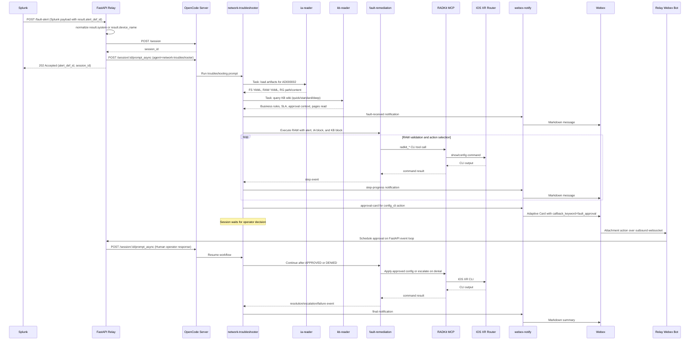

# Data Flow

The primary demo path uses `AD000002`, a BGP neighbor administrative shutdown fault on IOS XR. The same control flow applies to other alert definitions when a matching FS/RAW/RG artifact set exists.

The flow is driven by a scoped runtime context bundle: alert metadata selects the scenario, `ia-reader` loads approved artifacts, `kb-reader` loads operational context, RADKit MCP collects live state, and Webex or headed-mode input supplies approval state.

## Runtime Context Bundle

The runtime troubleshooting problem is a context engineering problem: when a fault fires, what exact information does the agent need in order to respond correctly?

| Bundle part | Source | Examples | Why it matters |
|-------------|--------|----------|----------------|
| Fault metadata | Splunk alert payload and relay normalization | `alert_def_id`, device hostname, severity, `neighbor_ip`, VRF, AS number, Splunk search context. | Selects the right artifact bundle and binds RAW inputs. |
| Approved intelligence artifacts | `ia-reader` reading `intelligence-artifacts/` | Fault Signature, Repair Action Workflow, Remediation Guide path/content. | Provides validated technical ground truth for the known fault. |
| Operational KB context | `kb-reader` through `wiki-query` | Business rules, maintenance windows, escalation path, known issue matches, incident history. | Adds organizational constraints that do not belong in the technical workflow. |
| Live network state | `fault-remediation` through RADKit MCP | CLI output, extracted variables, validation status, observed device facts. | Verifies what is true now instead of trusting the alert alone. |
| Operator approval | Webex card or headed-mode prompt | Approved, denied, skipped with warning, pending. | Controls whether service-impacting action may proceed. |

The runtime agent should not rediscover the fault from raw documents during the incident. That synthesis happens at author-time when engineers create and review intelligence artifacts and KB entries. If the runtime context is missing or contradictory, the correct behavior is to escalate rather than invent a repair.

## Sequence



## Alert Normalization

The relay expects a Splunk alert payload with a top-level `result` object. It requires:

| Field | Source | Purpose |
|-------|--------|---------|
| `result.alert_def_id` | Splunk result row | Selects the artifact group, such as `AD000002`. |
| `result.device_name` or `result.system` | Splunk result row | Becomes `device_hostname` in the agent prompt. |
| Other `result.*` fields | Splunk result row | Become `alert_vars` passed to the RAW. |
| `sid`, `search_name`, `app`, `owner`, `results_link` | Splunk alert metadata | Added to `alert_vars` as Splunk context. |
| `kb_query_mode` | Optional top-level override | Selects `quick`, `standard`, or `deep` KB wiki retrieval. |

The relay then builds a prompt with this shape:

```json
{
  "alert_def_id": "AD000002",
  "device_hostname": "xr-43",
  "mode": "strict",
  "alert_vars": {
    "neighbor_ip": "172.20.20.18",
    "vrf_name": "default",
    "neighbor_as": "3334"
  },
  "raw_message": null
}
```

## Approval Pause and Resume

When a RAW action reaches `config_cli`, `network-troubleshooter` asks `webex-notify` to send an approval card. The card contains three routing invariants:

| Field | Meaning |
|-------|---------|
| `callback_keyword: fault_approval` | Lets the Webex websocket bot route the card submit to the approval handler. |
| `alert_def_id` | Maps the decision back to the active OpenCode session. |
| `decision` | `APPROVED` or `DENIED`. |

The relay no longer exposes an inbound HTTP approval callback endpoint. Approval card clicks are received over the relay's outbound websocket connection to Webex, acknowledged in the Webex room, and forwarded to OpenCode with `prompt_async`.

## Headed vs. Headless

The agent workflow is the same in both modes; only the way the initial alert reaches OpenCode changes.

For new users, follow the OpenCode-first quickstarts rather than starting from the table below. The table is a reference for how headed and headless delivery differ under the hood.

| Aspect | Headed mode | Headless mode |
|--------|-------------|---------------|
| OpenCode entry point | `opencode` TUI | `opencode serve --port 4096` |
| Alert delivery | Paste the prompt from `python scripts/simulate_alert.py --direct` | Splunk or simulator posts to `POST /fault-alert` |
| Agent target | User selects or prompt routes to `network-troubleshooter` | Relay sends `agent: network-troubleshooter` in `prompt_async` |
| Approval | Type `APPROVED` or use the Webex card if configured | Click the Webex card; relay websocket bot forwards the decision |
| Monitoring | Watch the TUI | Watch Webex, relay logs, and OpenCode session messages |

## What Belongs Where

| Information type | Belongs in |
|------------------|------------|
| Fault detection logic, regex patterns, extracted variables | Fault Signature |
| Ordered validation, repair, wait, revalidate, resolve, fail, and escalate logic | Repair Action Workflow |
| Human-readable explanation of the fault and remediation approach | Remediation Guide |
| Business rules, approval policy, escalation paths, known issues, maintenance windows | KB wiki |
| Current BGP state, config snippets, logs, counters, and command output | Live RADKit MCP collection |
| Approval decision and reason | Webex/TUI approval path and session log |

Next: read [Agents](agents.md) for the permission model, or [Execution Modes](../configuration/execution-modes.md) for strict and hybrid behavior.