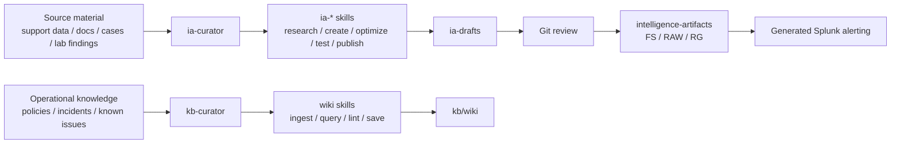
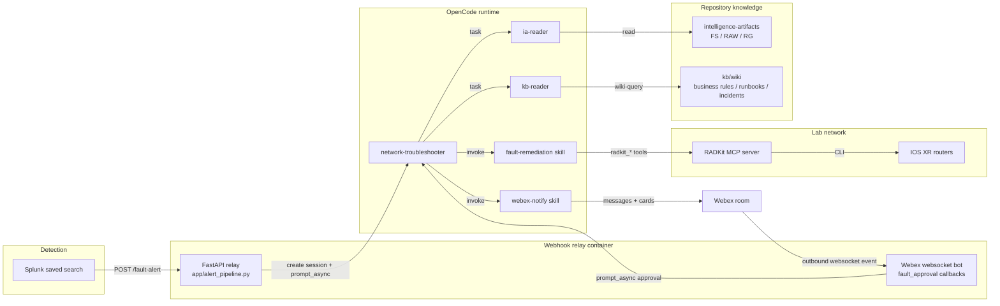

# Architecture Overview

Fault Intelligence as Code is a live demo system for turning a detected network fault into a grounded, auditable troubleshooting session. Splunk detects the event, the relay opens an OpenCode session, the `network-troubleshooter` agent loads the relevant fault intelligence, and RADKit MCP provides device access.

The architecture has two connected sides:

| Side | Purpose | Primary agents |
|------|---------|----------------|
| Author-time | Compile source knowledge into reviewed intelligence artifacts and operational KB content before any fault fires. | `ia-curator`, `kb-curator` |
| Runtime | Consume approved artifacts and KB context to diagnose, remediate, verify, or escalate an active fault. | `network-troubleshooter`, `ia-reader`, `kb-reader` |

For the runtime context assembled during an incident, see [Data Flow](data-flow.md). For the shared vocabulary behind the agentic terms, see [Agentic Concepts](agentic-concepts.md).

## Author-Time Architecture

Author-time work turns scattered expertise into durable knowledge sources. The IA curator workflow researches source material, drafts Remediation Guides, derives Fault Signatures and Repair Action Workflows, generates tests, and publishes through Git. The KB curator workflow ingests operational knowledge into the Markdown wiki.

The expensive synthesis happens here, before runtime. That keeps the live agent from rediscovering or reinterpreting raw documents during an incident.

## Runtime Architecture

At runtime, the troubleshooting agent consumes the compiled knowledge sources, verifies live network state through RADKit MCP, and pauses for approval before crossing a service-impacting action boundary.

## Repository as Control Plane

The repository is not only a storage location. It is the control plane for the agent harness.

| Path | Control-plane role |
|------|--------------------|
| `.opencode/agents/` | Defines agent roles, allowed skills, sub-agent permissions, and behavioral constraints. |
| `.opencode/skills/` | Defines reusable procedures for artifact authoring, RAW execution, Webex notification, and KB operations. |
| `opencode.json` | Selects model/provider settings, MCP servers, and agent-level tool allow-lists. |
| `intelligence-artifacts/` | Stores approved FS/RAW/RG bundles that runtime agents treat as technical ground truth. |
| `kb/` | Stores compiled operational memory in Markdown. |
| `app/` | Bridges Splunk-style alerts and Webex approval events into OpenCode sessions. |
| `scripts/` | Provides simulation, validation, testing, and deployment helpers. |

This is the practical payoff of the "as code" model: the same source of truth controls authoring, review, testing, deployment, and runtime behavior.

## Components

| Component | Technology | Role |
|-----------|------------|------|
| Splunk | Splunk saved search / alert action | Detects a fault signature match and sends a Splunk-shaped webhook payload to the relay. |
| Webhook relay | FastAPI in `app/alert_pipeline.py` | Normalizes Splunk payloads, creates OpenCode sessions, sends prompts to the target agent, exposes health checks, and proxies Splunk REST requests when needed. |
| Webex websocket bot | `webex-bot` library inside the relay process | Maintains an outbound websocket to Webex and forwards approval card clicks back to the matching OpenCode session. |
| OpenCode | OpenCode server or TUI | Hosts the configured model, agent definitions, skills, sub-agent tasks, and MCP tool calls. |
| `network-troubleshooter` | OpenCode primary agent | Orchestrates live fault diagnosis, session logging, artifact loading, KB lookup, RAW execution, Webex notifications, and approval handling. |
| `ia-reader` | OpenCode read-only sub-agent | Finds and returns Fault Signature, Repair Action Workflow, and Remediation Guide artifacts from `intelligence-artifacts/`. |
| `kb-reader` | OpenCode read-only sub-agent | Queries the KB wiki vault at `kb/wiki/` through the `wiki-query` skill. |
| `fault-remediation` | OpenCode skill | Interprets and executes the RAW against the device through RADKit MCP. |
| `webex-notify` | OpenCode skill | Renders notification templates and sends Webex messages or adaptive cards. |
| RADKit MCP | Remote MCP server | Provides network-device CLI access through tools prefixed with `radkit_`. |
| Cisco Support MCP | Local MCP server | Available for author-time intelligence-artifact work through the configured OpenCode environment. It is not part of the live remediation path. |

## Design Decisions

| Decision | Current choice | Why it matters |
|----------|----------------|----------------|
| Agent runtime | OpenCode with repository-defined agents | The demo is model-provider independent and the agent behavior is versioned with the repository. |
| Live troubleshooting authority | `network-troubleshooter` only | Runtime responsibilities are narrow: diagnose, execute the RAW, notify, and escalate. |
| Artifact access | `ia-reader` sub-agent | Live sessions can read FS/RAW/RG artifacts but cannot create or publish them. |
| KB access | `kb-reader` sub-agent plus `wiki-query` | Live sessions can retrieve business rules and incident context without gaining write access to the vault. |
| Device access | RADKit MCP | Network operations go through a controlled MCP tool surface rather than ad hoc SSH scripts. |
| Human approval | Webex adaptive card plus outbound websocket callback | Approval does not require exposing the relay on a public inbound URL. |
| Notification rendering | `webex-notify` templates | Message and card format lives in one skill and can be reviewed independently from the RAW interpreter. |
| Relay deployment | Docker Compose | The relay is a small FastAPI service; the OpenCode agent runtime stays on the host or another service. |

## Runtime Boundaries

The live fault path is intentionally read-only with respect to the repository. `network-troubleshooter` can read files, call RADKit tools, invoke `fault-remediation` and `webex-notify`, and delegate read-only work to `ia-reader` and `kb-reader`. It cannot edit files and it cannot call curator agents.

Author-time maintenance uses separate curator agents:

| Agent | Purpose |
|-------|---------|
| `ia-curator` | Creates, researches, optimizes, and publishes intelligence artifacts. |
| `kb-curator` | Ingests, lints, and maintains the KB wiki vault. |

This separation prevents a live troubleshooting session from silently changing the knowledge base or the artifact library while a fault is active.