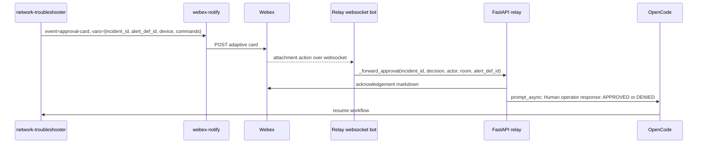

# Webex Integration

Webex is used for operator visibility and approval. The integration has two parts:

1. `webex-notify` sends outbound messages and adaptive cards through the Webex REST API.
2. The relay starts a Webex websocket bot that receives approval card submits and forwards decisions to OpenCode.

No inbound public Webex callback URL is required for approvals.

## Approval Policy

Human approval is a policy boundary in the agent harness, not an informal trust step. The runtime workflow can move quickly through retrieval, validation, and low-risk diagnostics, but service-impacting actions must pause for an explicit operator decision.

In this prototype, the important boundary is any RAW action that executes operational commands through `exec_cli` or `config_cli`. The agent sends the proposed action through the `webex-notify` skill, waits for approval or denial, and records the decision in the incident flow. If Webex is not configured, the local test path auto-approves with an explicit warning so the absence of approval infrastructure is visible in the session log.

An approval card should give the operator enough context to make the decision without reading the entire OpenCode session:

| Card detail | Purpose |
|-------------|---------|
| Incident and alert definition | Identifies the active fault and artifact bundle. |
| Affected device and variables | Shows what device, neighbor, VRF, interface, or component is in scope. |
| Severity and known context | Summarizes business impact, known issue matches, or maintenance-window context when available. |
| Collected evidence | Shows the validation output that led to the proposed action. |
| Proposed command or change | Makes the exact action visible before approval. |
| Approve/Deny action | Captures the operator decision and resumes or escalates the workflow. |

## Required Environment

Set these variables in the environment where OpenCode runs and in the relay container or process:

```bash
export WEBEX_BOT_TOKEN="your-bot-token"
export WEBEX_ROOM_ID="your-room-id"
```

`WEBEX_API_BASE` is optional and defaults to `https://webexapis.com/v1`.

## Notification Templates

The `webex-notify` skill owns the Webex message format. Templates live under `.opencode/skills/webex-notify/references/`:

| Event | Template |
|-------|----------|
| Fault received | `fault-received.md` |
| Step progress | `step-progress.md` |
| Approval request | `approval-card.json` |
| Resolution | `resolution.md` |
| Escalation | `escalation.md` |
| Failure | `failure.md` |
| Denial | `denial.md` |

Markdown templates are sent as Webex markdown messages. `approval-card.json` is sent as an adaptive card.

## Approval Card Routing

Approval cards must preserve these fields:

| Field | Required value |
|-------|----------------|
| `actions[*].data.callback_keyword` | `fault_approval` |
| `actions[*].data.alert_def_id` | The alert definition ID for the active session, such as `AD000002`. |
| `actions[*].data.decision` | `APPROVED` or `DENIED`. |

The relay registers a `FaultApprovalCommand` with `card_callback_keyword="fault_approval"`. When an operator clicks Approve or Deny, the `webex-bot` library receives the attachment action over an outbound websocket connection to Webex Cloud.

## Callback Flow



The relay tracks active sessions in memory as `incident_id -> session metadata`. `alert_def_id` remains display/audit metadata because multiple simultaneous incidents can share the same Alert Definition. If a callback omits `incident_id`, the relay falls back to the most recently registered session for single-fault demo mode.

## Behavior When Webex Is Not Configured

If either `WEBEX_BOT_TOKEN` or `WEBEX_ROOM_ID` is missing, `webex-notify` returns:

```json
{"status": "skipped", "reason": "env-not-set"}
```

For normal progress notifications, that means no Webex message is sent. For an approval card, `network-troubleshooter` treats the skipped notification as an auto-approval and writes an explicit warning to the session log. This keeps headed-mode and local testing usable without Webex credentials.

## Room Filtering

When `WEBEX_ROOM_ID` is set, the websocket bot uses it as the approved room list. If it is missing, the bot cannot filter rooms and logs a warning. For demos and shared environments, always set `WEBEX_ROOM_ID`.
