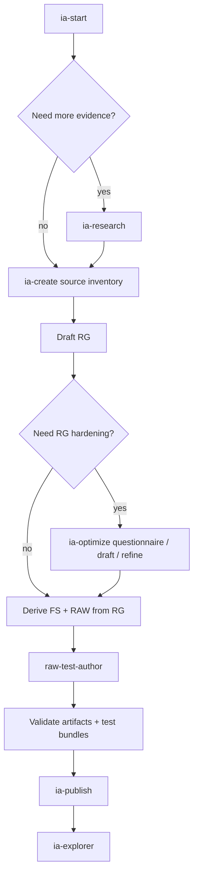
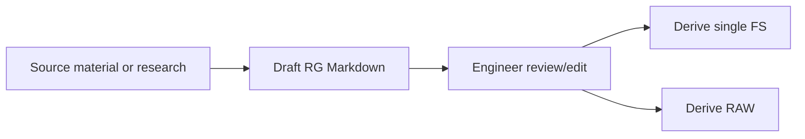

# Authoring Workflow

The `ia-curator` agent is the supported path for adding or changing fault scenarios. Use it as a guided workflow, not as a one-off generator: research prepares evidence, creation drafts and validates the artifacts, optimization tightens the Remediation Guide, test authoring adds deterministic RAW coverage, and publishing assigns final IDs and updates indexes.

OpenCode is the primary interface for this workflow. Select `ia-curator` and paste the prompts shown below. Manual commands are included only as fallback or reference.

## Skill Map

| Skill | Ask `ia-curator` to... | Main outputs |
|-------|----------------------|--------------|
| `ia-start` | Workspace onboarding, MCP checks, `ia-config.yml` setup, and discovery of in-progress drafts or research folders. | Updated `ia-config.yml`, setup status, next-step guidance. |
| `ia-research` | Structured research before artifact creation. It can start from syslogs, SRs, defects, reference files, or sparse single-source input. | `research/<issue-name>/cisco-support-findings.md`, `cisco-docs-findings.md`, and `research-summary.md`. |
| `ia-create` | Draft RG, FS, and RAW artifacts from research, syslogs, CLI output, existing guides, or free-form source material. | `ia-drafts/AD000000-<slug>/` with RG/FS/RAW artifacts and companion analysis docs. |
| `ia-optimize` | Improve an existing RG or raw troubleshooting guide through questionnaire, draft, and refinement modes. | Optimized `.md` RG files, gap markers, clarifying questions, and optimization summaries. |
| `raw-test-author` | Create and validate deterministic RAW test bundles for terminal paths and approvals. | `tests/<RAW######>-<slug>.tests.yml` plus validator/headless-runner results. |
| `ia-publish` | Allocate real IDs, copy selected drafts into `intelligence-artifacts/`, preserve tests/docs, update indexes, and open a PR. | Published artifact folder, refreshed `index.md` / `index.json`, PR-ready git changes. |
| `ia-explorer` | Regenerate the standalone artifact explorer after published index changes. | `docs/index.html`. |

## Scenario Layout

A published fault scenario is an Alert Definition folder under `intelligence-artifacts/`. Draft folders under `ia-drafts/` use the same shape with placeholder IDs.

```text
intelligence-artifacts/
  AD000004-example-fault/
    FS000004-EXAMPLE_FAULT.yml
    RAW000004-EXAMPLE_FAULT_REPAIR.yml
    RG000004-example-fault-guide.md
    tests/
      RAW000004-EXAMPLE_FAULT_REPAIR.tests.yml
    docs/
      FS000004.analysis.md
      RAW000004.analysis.md
      RG000004.analysis.md
```

Keep the six-digit suffix aligned across AD, FS, RAW, and RG names. Only artifacts and the `tests/` folder belong at the AD root; companion analysis, notes, screenshots, and other supporting files belong under `docs/`.

## End-to-End Flow



## 1. Start and Configure

Select the `ia-curator` agent in OpenCode and paste:

```text
ia-start
```

It validates Cisco Docs and Cisco Support MCP connectivity, reads or populates `ia-config.yml`, detects in-progress folders under `ia-drafts/` and `research/`, and explains which IA skill to run next. Missing Cisco MCP servers do not block every workflow, but they limit `ia-research` and `ia-optimize` enrichment.

`ia-config.yml` stores workspace identity, product and OS scope, default metadata, validation rules, naming prefixes, and output preferences. `ia-create` applies this config during generation and surfaces allow-list warnings when generated metadata falls outside configured values.

## 2. Research the Fault

Use `ia-research` when the source material is incomplete, when you only have an SR or defect ID, or when the artifact should be grounded in Cisco support/docs evidence:

```text
ia-research %ROUTING-BGP-5-ADJCHANGE maximum number of prefixes reached on IOS XR
```

The skill collects or enriches these inputs:

| Input | What `ia-research` does |
|-------|-------------------------|
| Syslog or alarm strings | Searches support/docs for meaning, causes, remediation, and related defects. |
| SR IDs | Fetches case details and extracts syslogs, linked defects, platform context, and resolution notes. |
| Defect IDs | Fetches bug details, affected platforms, symptoms, workarounds, and fixed releases. |
| Reference files | Reads explicitly supplied files and extracts useful signals. |
| Sparse single-source input | Runs an enrichment pass first, then performs broader research with the discovered signals. |

Outputs are written to `research/<issue-name>/`. The key handoff file is `research-summary.md`, which includes artifact-specific recommendations based on the artifact types selected during research.

## 3. Create Draft Artifacts

Ask `ia-curator` to create the draft with the research folder, syslogs, existing guide, or other source material:

```text
ia-create a new BGP maximum-prefix scenario from research/bgp-max-prefix-adjchange-xr/
```

`ia-create` starts with two interactive gates:

1. Research gate: asks whether to run `ia-research` first.
2. Source inventory: asks which source types are available and where they live.

The recommended path is RG first. `ia-create` drafts a Markdown Remediation Guide, writes a companion analysis file, and then asks whether to review the RG before deriving FS and RAW.



Selecting RG, FS, and RAW together is supported, but FS and RAW will be derived from an unreviewed RG draft. For new scenarios, review or optimize the RG before deriving YAML whenever possible.

## 4. Optimize the Remediation Guide

Use `ia-optimize` when the RG is too vague, too generic, missing pass/fail examples, missing thresholds, or not platform-specific enough:

```text
ia-optimize ia-drafts/AD000000-example-fault/RG000000-example-fault-guide.md
```

`ia-optimize` has three modes:

| Mode | Trigger | Result |
|------|---------|--------|
| Questionnaire | Source has no `## Clarifying Questions` section. | Generates targeted SME questions mapped to RG sections. |
| First draft | Questionnaire has answered `> **Answer:**` blocks. | Generates an optimized RG with concrete CLI, pass/fail output, decision branches, and `[GAP]` markers for unanswered items. |
| Refinement | Optimized RG has newly answered questions. | Replaces matching gaps surgically and updates the optimization summary. |

During optimization, the skill can optionally query Cisco Support and Cisco Docs for SRs, defects, platform CLI, thresholds, and known fixed releases. The optimized RG still uses the same RG template as `ia-create`, so it can be fed back into `ia-create` to derive or regenerate FS and RAW.

## 5. Derive FS and RAW from the Reviewed RG

When the RG is ready, return to `ia-create` and use the post-generation option to create FS + RAW from the edited RG.

`ia-create` derives:

| Artifact | Derived from | Notes |
|----------|--------------|-------|
| Fault Signature | RG Triggering Events | Multiple related syslogs become multiple events in one FS, tied together by `conditions.logic`. |
| Repair Action Workflow | RG Diagnosis & Repair Steps | Decision points become `action_select` branches; inputs come from FS extracted variables or alert payload. |
| Companion analysis | Source mappings and assumptions | Analysis files live under `docs/` and record decisions, gaps, and open review items. |

Primary prompt for validation:

```text
ia-create validate ia-drafts/AD000000-<issue-name>/
```

Manual fallback:

```bash
python .opencode/skills/ia-create/scripts/validate_artifact.py ia-drafts/AD000000-<issue-name>/
```

Fix validation errors before moving on. Warnings should be reviewed, especially cross-reference, naming, and allow-list warnings.

## 6. Generate RAW Tests

RAW tests are part of the authoring workflow, not an afterthought. After a RAW exists, ask `ia-curator` to use `raw-test-author` for a specific RAW.

Primary prompt:

```text
raw-test-author create tests for ia-drafts/AD000000-<issue-name>/RAW000000-<slug>.yml
```

`raw-test-author` creates one co-located bundle per RAW:

```text
ia-drafts/AD000000-<issue-name>/tests/RAW000000-<slug>.tests.yml
```

It reads the RAW and paired FS, enumerates terminal leaves, creates synthetic CLI/log fixtures, and adds scripted approvals for `exec_cli` and `config_cli` paths. Good coverage includes resolution, escalation, failure where applicable, approval denial, missing or malformed inputs, and every deterministic terminal branch.

Validate the bundle before publishing:

```text
raw-test-author validate ia-drafts/AD000000-<issue-name>/tests/RAW000000-<slug>.tests.yml
```

Run the bundle through the troubleshooting agent test mode when you want to exercise the workflow the same way a user-facing prompt does:

```text
Run the RAW test bundle in test mode.

Simulate network-device responses from the test bundle. Do not use RADKit, Splunk, Webex, Docker, or the alert simulator script. Use the network-troubleshooter test-mode behavior and write the generated test artifacts under logs/test-runs/.

{
  "alert_def_id": "AD000000",
  "device_hostname": "<test-device>",
  "mode": "strict",
  "test_bundle_path": "ia-drafts/AD000000-<issue-name>/tests/RAW000000-<slug>.tests.yml",
  "webex_notify": false
}
```

Manual fallback:

```bash
python .opencode/skills/raw-test-author/scripts/validate_test_bundle.py ia-drafts/AD000000-<issue-name>/tests/RAW000000-<slug>.tests.yml
python .opencode/skills/raw-test-author/scripts/validate_test_bundle.py ia-drafts/AD000000-<issue-name>/tests/RAW000000-<slug>.tests.yml --strict
python scripts/run_raw_tests.py --bundle ia-drafts/AD000000-<issue-name>/tests/RAW000000-<slug>.tests.yml
```

Do not mark deterministic paths `agent_only` just to bypass the runner. Patch the fixture or runner when deterministic RAW behavior is not covered.

## 7. Review Before Publishing

Before publishing a scenario:

- [ ] RG has been reviewed or optimized and has no unresolved critical gaps.
- [ ] FS, RAW, and RG suffixes match or use draft placeholders before publish.
- [ ] Message samples use sanitized addresses, names, and ASNs.
- [ ] RAW inputs are supplied by the FS, alert payload, or prior workflow outputs.
- [ ] `exec_cli` and `config_cli` paths have approval coverage.
- [ ] Test bundles cover deterministic terminal paths and pass strict validation plus the headless runner.
- [ ] Companion analysis files are under `docs/`.
- [ ] Scenario docs explain lab assumptions, safe cleanup, and Splunk integration if applicable.

## 8. Publish

Use `ia-publish` to move reviewed draft artifacts from `ia-drafts/` into `intelligence-artifacts/`:

```text
ia-publish
```

`ia-publish` selects draft artifacts, allocates real IDs, rewrites placeholder IDs, preserves `tests/` and `docs/`, validates allocated artifacts, prompts for missing RAW test coverage, updates `intelligence-artifacts/index.md` and `index.json`, and prepares Git/GitHub pull-request-ready changes. Publishing has a soft test-coverage gate: missing bundles can be authored immediately, skipped with a warning, or used to abort the publish.

## 9. Wire Splunk Alerting

Use the Splunk generator when the FS uses syslog events:

Primary prompt for Builder:

```text
Generate Splunk alerting for AD000004
```

Manual fallback:

```bash
cd scripts/splunk-alert-def-generator
python fs_to_alert.py AD000004 --repo-root ../.. --webhook-url http://<relay-host>:8080/fault-alert --output ad000004.yml
python splunk_alerts.py --create --config ad000004.yml --password "$SPLUNK_PASSWORD"
```

## 10. Explore Published Artifacts

Use `ia-explorer` after publishing to regenerate the standalone artifact explorer:

```text
ia-explorer
```

It reads `intelligence-artifacts/index.json`, writes `docs/index.html`, and opens the explorer. The explorer supports syslog regex search, keyword and ID search, filters, coverage matrix views, message samples, and artifact cross-links.
