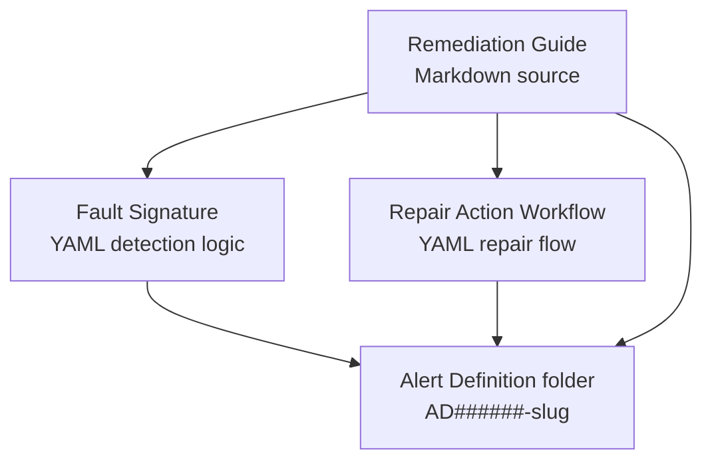

# Fault Intelligence Concepts

Fault Intelligence captures a known fault as a linked set of reviewable artifacts. The human source is the Remediation Guide, and the machine-readable outputs are the Fault Signature and Repair Action Workflow.



## Linked Set

Each published fault lives under one alert definition folder:

```text
intelligence-artifacts/AD000002-bgp-neighbor-admin-shutdown-xr/
  FS000002-BGP_NEIGHBOR_ADMIN_SHUTDOWN.yml
  RG000002-BGP_NEIGHBOR_ADMIN_SHUTDOWN_GUIDE.md
  RAW000002-BGP_NEIGHBOR_ADMIN_SHUTDOWN_REPAIR.yml
```

The IDs share the same six-digit suffix:

| Artifact | Example | Role |
|----------|---------|------|
| Alert Definition | `AD000002` | Folder-level grouping and alert identity. |
| Fault Signature | `FS000002` | Detects the fault and extracts variables. |
| Remediation Guide | `RG000002` | Human-authored Markdown source and review artifact. |
| Repair Action Workflow | `RAW000002` | Machine-readable diagnosis and repair workflow. |

## Authoring vs Runtime

| Phase | What happens |
|-------|--------------|
| Authoring | `ia-create` drafts an RG first, optionally pauses for review, then derives the FS and RAW from the edited RG. |
| Publishing | `ia-publish` copies selected draft artifacts from `ia-drafts/` into `intelligence-artifacts/`, updates `index.md`, regenerates `index.json`, and can refresh the explorer. |
| Runtime | `ia-reader` loads the published artifact group, `fault-remediation` executes the RAW, and the RG remains available as the human-readable source and review document. |

## Current Published Scenarios

| Alert definition | Fault | Notes |
|------------------|-------|-------|
| `AD000002` | BGP neighbor administrative shutdown on IOS XR | Current simulator default and primary walkthrough. |
| `AD000003` | BGP neighbor maximum-prefix limit exceeded on IOS XR | Additional published scenario. |

## Health Intelligence

The IA skills also define future Health Intelligence artifact types: Collection List, Parser, and Health Check Rule. Their schemas are present, but generation support is currently stub/future-oriented. See [Health Intelligence](health-intelligence.md) for the status page.