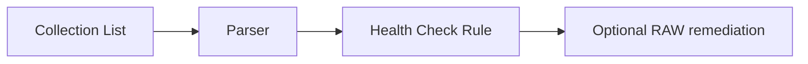

# Health Intelligence

Health Intelligence is the planned proactive side of the IA model. Instead of waiting for a fault signature match, it defines what to collect, how to parse it, and how to evaluate health conditions.

## Current Status

The schemas and references exist under `.opencode/skills/ia-create/`, but generation support is stub/future-oriented.

| Artifact | ID format | Purpose | Status |
|----------|-----------|---------|--------|
| Collection List | `CL######` | Define CLI, gNMI, NETCONF, or telemetry data to collect. | Schema present, generation stub. |
| Parser | `PARSE######` | Transform raw output into structured fields. | Schema present, generation stub. |
| Health Check Rule | `HCR######` | Evaluate parsed fields against health rules. | Schema present, generation stub. |

Health Check Rules may eventually trigger RAW remediation through a workflow reference, connecting proactive health monitoring to the same repair workflows used by Fault Intelligence.