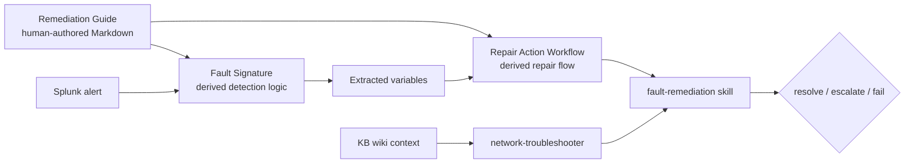

# Fault Intelligence Overview

Fault intelligence is the version-controlled expression of how to detect, diagnose, and repair a known network fault. In this repository, a published alert definition is represented by three linked artifacts: FS, RAW, and RG.

For the full data model reference, see the Fault Intelligence Standards Reference in the repository's root `AGENTS.md`.

## Section Guide

| Page | Purpose |
|------|---------|
| [Concepts](concepts.md) | Linked sets, authoring vs runtime, and current scenarios. |
| [Authoring Workflow](authoring-workflow.md) | How `ia-start`, `ia-create`, `ia-publish`, and `ia-explorer` fit together. |
| [Remediation Guides](remediation-guides.md) | Markdown RG format and RG-to-FS/RAW derivation. |
| [Fault Signatures](fault-signatures.md) | FS YAML structure and detection logic. |
| [Repair Action Workflows](repair-action-workflows.md) | RAW YAML structure and runtime action model. |
| [Cross-References](cross-references.md) | Linked-set IDs, references, and validation checks. |
| [Best Practices](best-practices.md) | Common authoring and publishing guidance. |
| [Glossary](glossary.md) | IA terms and naming conventions. |
| [Health Intelligence](health-intelligence.md) | Stub/future health-artifact model. |

## Artifact Group Layout

Artifacts are grouped under `intelligence-artifacts/<alert-definition-id>-<slug>/`:

```text
intelligence-artifacts/
  AD000002-bgp-neighbor-admin-shutdown-xr/
    FS000002-BGP_NEIGHBOR_ADMIN_SHUTDOWN.yml
    RAW000002-BGP_NEIGHBOR_ADMIN_SHUTDOWN_REPAIR.yml
    RG000002-BGP_NEIGHBOR_ADMIN_SHUTDOWN_GUIDE.md
    tests/
```

The generated index files at `intelligence-artifacts/index.md` and `intelligence-artifacts/index.json` summarize the published catalog.

## Fault Signature (FS)

A Fault Signature defines when a fault has occurred. It contains metadata, applicability, detection events, regex evaluation rules, extracted variables, and optional clear-event logic.

For `AD000002`, `FS000002-BGP_NEIGHBOR_ADMIN_SHUTDOWN.yml` detects this IOS XR syslog pattern:

```text
%ROUTING-BGP-5-ADJCHANGE : neighbor <ip> Down - Admin. shutdown (VRF: <vrf>) (AS: <asn>)
```

It extracts:

| Variable | Meaning |
|----------|---------|
| `neighbor_ip` | BGP neighbor that was administratively shut down. |
| `vrf_name` | VRF containing the neighbor session. |
| `neighbor_as` | Remote AS shown in the event. |

The relay receives these values from Splunk in the alert payload, then passes them to the agent as `alert_vars`.

## Repair Action Workflow (RAW)

A Repair Action Workflow is the executable remediation plan. It defines inputs, ordered steps, validations, action selection, and terminal outcomes such as resolve, escalate, fail, or partial success.

For `AD000002`, `RAW000002-BGP_NEIGHBOR_ADMIN_SHUTDOWN_REPAIR.yml` performs this sequence:

| Step | Name | Purpose |
|------|------|---------|
| 1 | `confirm_admin_shutdown` | Confirm `BGP state = Idle (Admin)` and extract the local BGP AS from running config. |
| 2 | `confirm_shutdown_in_config` | Confirm `shutdown` is present under the neighbor stanza. |
| 3 | `remove_admin_shutdown` | Request approval, then run `no shutdown` under the BGP neighbor. |
| 4 | `verify_session_reestablishment` | Confirm the session returns to `Established` or escalate with diagnostics. |

The `fault-remediation` skill interprets the RAW. It runs validation commands through RADKit MCP, evaluates regex patterns, updates variables, selects actions, and surfaces events back to `network-troubleshooter`.

## Remediation Guide (RG)

A Remediation Guide is the human-readable troubleshooting and remediation source document for a fault. It is written in Markdown by a network engineer or SME, contains no regex or YAML syntax, and reads like a knowledge base article that another engineer can review and edit.

In the artifact-creation workflow, the RG is generated and reviewed first. AI tooling then derives both the Fault Signature and the Repair Action Workflow from the edited RG: triggering events map to FS detection logic, and diagnosis/repair steps map to RAW validation and action flow.

For `AD000002`, `RG000002-BGP_NEIGHBOR_ADMIN_SHUTDOWN_GUIDE.md` documents the IOS XR operator workflow for restoring a neighbor that was placed into administrative shutdown.

At runtime, the live agent executes the machine-readable RAW. The RG remains the human-readable source and review artifact for the linked FS and RAW.

## Runtime Relationship



At authoring time, `ia-create` treats the RG as the primary Markdown source for deriving FS and RAW artifacts. At runtime, `ia-reader` loads the matching artifact group and returns the FS/RAW/RG context to `network-troubleshooter`; `kb-reader` separately retrieves operational context from `kb/wiki/`, such as approval requirements and escalation policy.

## Published Scenarios

| Alert definition | Fault | Artifacts |
|------------------|-------|-----------|
| `AD000002` | BGP neighbor administrative shutdown on IOS XR | `FS000002`, `RAW000002`, `RG000002` |
| `AD000003` | BGP neighbor maximum-prefix limit exceeded on IOS XR | `FS000003`, `RAW000003`, `RG000003` |

`AD000002` is the current default for `scripts/simulate_alert.py` and the primary demo walkthrough in these docs.