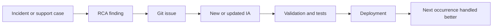

# Lessons Learned

Fault Intelligence as Code is production-proven as an operating model. The agentic prototype shows one way to operationalize it with agents, skills, RAG-style retrieval, MCP tools, and human approval.

The main lesson is that agentic operations is not just about giving an LLM tools. It depends on how the organization standardizes fault knowledge, governs action, and closes the loop from incident findings back into durable intelligence.

## Consistent IA Schemas Reduce Support Friction

Operators and vendors benefit when both sides can refer to the same intelligence artifact ID, evidence bundle, detection condition, and collection workflow.

Instead of opening a support case with only symptoms and raw logs, an operator can reference a specific IA. The vendor can confirm the expected evidence, request the next IA-driven collection step, or provide an updated artifact. That reduces back-and-forth and makes support cases easier to automate.

## Closed Loop RCA Becomes Practical

Support findings should not stay trapped in tickets. When a case identifies a new condition, better detection logic, missing evidence, or a safer remediation path, that finding should become a Git issue or pull request against the intelligence artifact library.

That creates a closed loop:

The next time the condition occurs, the system starts with better ground truth.

## Most IAs Diagnose or Mitigate

Automatic fix is only one use case. Many high-value intelligence artifacts diagnose, classify, isolate impact, or collect the right evidence for escalation.

That matters because active remediation is not always the safest or most useful response. A good IA can still reduce toil by answering:

- What category of issue is occurring?
- Which device, neighbor, interface, or component is affected?
- What evidence should be collected before state changes?
- Is there a known issue, workaround, or escalation path?
- Is mitigation possible without increasing risk?

## Guardrails Determine Reliability

Harness configuration helps, but it is not enough by itself. Deterministic behavior depends on several layers working together:

| Layer | Reliability contribution |
|-------|--------------------------|
| Artifact schema | Defines what the workflow can detect, collect, repair, verify, and escalate. |
| Agent prompt | Establishes responsibility, boundaries, and expected behavior. |
| Skills | Encode repeatable procedures such as RAW execution and Webex notification. |
| MCP tools | Provide structured, predictable access to external systems. |
| Tests | Exercise deterministic terminal paths and approval behavior before publication. |
| Human approval | Gates service-impacting action where judgment or risk requires it. |

The prototype reinforced one practical rule: if an agent is allowed to infer that it already has required data, it may skip collection that the workflow intended. The fix is to make collection, validation, and variable use explicit in the RAW and skill policy.

## Strict and Hybrid Modes Both Matter

Strict mode is the right foundation for known faults with reviewed intelligence artifacts. The agent follows the RAW exactly and escalates when the observed state does not match the workflow.

Hybrid mode is useful when the workflow is relevant but incomplete for the incident at hand. It allows additional investigation and network-engineering judgment, while preserving approval gates for service-impacting actions.

The practical split is:

| Activity | Recommended posture |
|----------|---------------------|
| Passive diagnostics | Can run broadly when collection is safe and useful. |
| Active remediation | Should stay tied to known issues with approved workflows and explicit approval. |
| Ambiguous incidents | Use hybrid investigation, then escalate if no safe action remains. |

## Structured Data Is Easier to Integrate Than Ever

GenAI makes it easier to connect structured intelligence artifacts to tool APIs, event platforms, ticketing systems, and automation frameworks. That changes the integration burden.

The long-term opportunity is a common interface for fault intelligence across vendors. Operators should not have to manually research, normalize, encode, and maintain every vendor's fault logic independently. Vendors know how their products fail; operators know their environment and policy. Standard IA schemas give both sides a shared contract.

## Practical Next Steps

For teams adopting this pattern:

1. Start with passive diagnostics and evidence collection for known faults.
2. Create reviewed FS/RAW/RG bundles for the highest-volume or highest-friction incidents.
3. Add RAW tests before publishing active remediation workflows.
4. Keep business policy in the KB instead of hard-coding it into technical workflows.
5. Require explicit approval for service-impacting action.
6. Feed incident findings back into artifact updates through Git issues and pull requests.