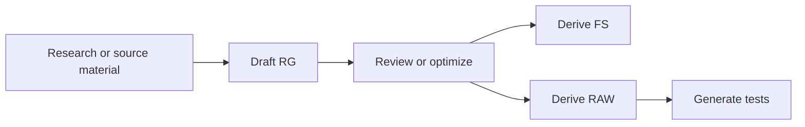

# Artifact Authoring Quickstart

Use this quickstart when you want to create a new Fault Intelligence scenario. The short version is: start the workspace, research the fault when needed, create or optimize the Remediation Guide, derive FS and RAW, generate tests, then publish.

For the detailed flow, see [Authoring Workflow](../fault-intelligence/authoring-workflow.md).

Use the `ia-curator` agent for this quickstart. It owns the `ia-start`, `ia-research`, `ia-create`, `ia-optimize`, `raw-test-author`, `ia-publish`, and `ia-explorer` skills.

## Skill Sequence

| Step | Skill | Purpose |
|------|-------|---------|
| 1 | `ia-start` | Check setup, config, MCP availability, and in-progress work. |
| 2 | `ia-research` | Gather Cisco support/docs evidence when source material is incomplete. |
| 3 | `ia-create` | Draft the RG and derive FS + RAW. |
| 4 | `ia-optimize` | Tighten the RG through questionnaire, SME answers, research enrichment, and refinement. |
| 5 | `raw-test-author` | Create deterministic RAW tests and validate branch coverage. |
| 6 | `ia-publish` | Allocate real IDs, preserve tests/docs, update indexes, and prepare a PR. |
| 7 | `ia-explorer` | Refresh the standalone artifact explorer. |

## 1. Start the Workspace

Open the repository in OpenCode, select the `ia-curator` agent, and paste:

```text
ia-start
```

This validates MCP connectivity, reads or updates `ia-config.yml`, reports draft folders under `ia-drafts/`, reports research folders under `research/`, and tells you which skill to run next.

## 2. Research First When Evidence Is Thin

Ask `ia-curator` to research when you have only a syslog, SR ID, defect ID, reference file, or partial description:

```text
ia-research %ROUTING-BGP-5-ADJCHANGE maximum number of prefixes reached on IOS XR
```

Research can use Cisco Support and Cisco Docs MCP servers to collect case details, bug details, related defects, platform context, documentation guidance, and recommended remediation. It writes structured findings under:

```text
research/<issue-name>/
```

Use the generated `research-summary.md` as the source for `ia-create`.

NOTE: Cisco Docs MCP server is currently unavailable and planned for H2 CY26. Until then, `ia-research` can only pull from Cisco Support APIs MCP server.

## 3. Create the Draft Scenario

Ask `ia-curator` to create the draft from your source material:

```text
ia-create a new BGP maximum-prefix scenario from research/bgp-max-prefix-adjchange-xr/
```

`ia-create` will ask whether to run research first, inventory the source material, derive a draft issue name, and generate artifacts under:

```text
ia-drafts/AD000000-<issue-name>/
```

The recommended authoring path is RG first:



## 4. Optimize the Remediation Guide

Before deriving FS and RAW, run `ia-optimize` if the RG has gaps, vague thresholds, missing decision branches, missing sample outputs, or generic commands:

```text
ia-optimize ia-drafts/AD000000-<issue-name>/RG000000-<slug>.md
```

The optimize flow has three modes:

- Questionnaire: generates SME questions mapped to RG sections.
- First draft: turns answered questions into an optimized RG with concrete CLI, pass/fail examples, and `[GAP]` markers where answers are still missing.
- Refinement: updates an optimized RG after additional answers are filled in.

`ia-optimize` can also offer targeted Cisco Support or Cisco Docs research to reduce gaps before drafting or refinement.

## 5. Derive FS and RAW

Return to `ia-create` and use the post-generation option to create FS + RAW from the reviewed RG.

`ia-create` will:

- Map RG triggering events into one Fault Signature with one or more events.
- Map RG diagnosis and repair steps into a Repair Action Workflow.
- Generate companion analysis files under `docs/`.
- Validate generated YAML with `.opencode/skills/ia-create/scripts/validate_artifact.py`.

## 6. Generate RAW Tests

After the RAW exists, generate the test bundle from the `ia-create` post-generation menu or invoke `raw-test-author` directly:

```text
raw-test-author create tests for ia-drafts/AD000000-<issue-name>/RAW000000-<slug>.yml
```

The test authoring skill reads the RAW and paired FS, enumerates terminal leaves, builds synthetic CLI/log responses, and adds scripted approvals for service-impacting commands. Test bundles live here:

```text
ia-drafts/AD000000-<issue-name>/tests/RAW000000-<slug>.tests.yml
```

Primary prompt for `ia-curator` validation:

```text
raw-test-author validate ia-drafts/AD000000-<issue-name>/tests/RAW000000-<slug>.tests.yml
```

Manual fallback:

```bash
python .opencode/skills/raw-test-author/scripts/validate_test_bundle.py ia-drafts/AD000000-<issue-name>/tests/RAW000000-<slug>.tests.yml
python .opencode/skills/raw-test-author/scripts/validate_test_bundle.py ia-drafts/AD000000-<issue-name>/tests/RAW000000-<slug>.tests.yml --strict
python scripts/run_raw_tests.py --bundle ia-drafts/AD000000-<issue-name>/tests/RAW000000-<slug>.tests.yml
```

Good coverage includes the happy path, escalation paths, approval denial, malformed or missing input paths, and every deterministic terminal branch.

## 7. Publish and Refresh Indexes

Publish reviewed drafts by asking `ia-curator`:

```text
ia-publish
```

Publishing allocates real IDs, rewrites draft placeholders, preserves `tests/` and `docs/`, checks for missing RAW test coverage, updates `intelligence-artifacts/index.md` and `index.json`, and prepares Git/GitHub pull-request-ready changes. Depending on your local GitHub setup, the agent may guide you through branch, commit, push, and PR creation, or leave the repository in a clean state for you to run those steps manually.

After publishing, refresh the standalone explorer:

```text
ia-explorer
```

## 8. Generate Splunk Alerting

If the Fault Signature uses syslog events, generate a Splunk saved-search config:

Primary prompt for Builder:

```text
Generate Splunk alerting for AD000004
```

Manual fallback:

```bash
cd scripts/splunk-alert-def-generator
python fs_to_alert.py AD000004 --repo-root ../.. --webhook-url http://<relay-host>:8080/fault-alert --output ad000004.yml
python splunk_alerts.py --create --config ad000004.yml --password "$SPLUNK_PASSWORD"
```

## 9. Review Before Sharing

- RG has been reviewed or optimized and has no unresolved critical gaps.
- FS, RAW, and RG suffixes match after publish.
- Message samples use sanitized addresses, names, and ASNs.
- RAW inputs are supplied by the FS, alert payload, or prior workflow outputs.
- `exec_cli` and `config_cli` paths have approval coverage.
- RAW tests pass strict validation and the headless runner.
- Companion analysis files live under `docs/`.
- Test bundles live under `tests/`.
- Splunk saved-search config points to the correct relay endpoint.
