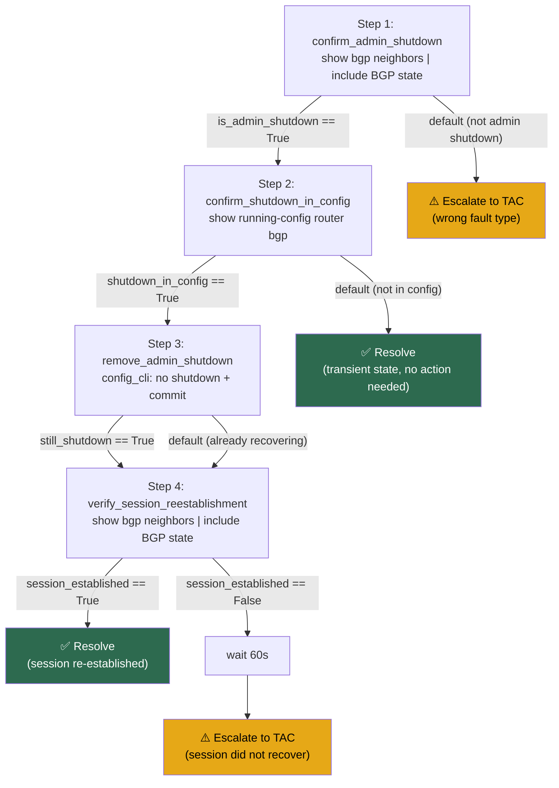

# BGP_NEIGHBOR_ADMIN_SHUTDOWN_REPAIR — Repair Action Workflow Analysis

## Source-to-Step Mapping

| # | RG Step | RAW Step ID | Step Name | Notes |
|---|---|---|---|---|
| 1 | Step 1: Confirm the Neighbor Is in Administrative Shutdown | `1` | `confirm_admin_shutdown` | `eval_cli` on `show bgp neighbors` filtered for BGP state. Exits to escalate if not admin shutdown — this workflow does not apply to other down reasons. |
| 2 | Step 2: Confirm the Shutdown Is in the Running Configuration | `2` | `confirm_shutdown_in_config` | `eval_cli` on `show running-config`. If shutdown not in config, resolves as transient state (no config change needed). |
| 3 | Step 3: Remove the Administrative Shutdown | `3` | `remove_admin_shutdown` | `config_cli` with `no shutdown` + `commit`. Re-validates state before applying to guard against race conditions. Human approval gate handled by network-troubleshooter agent (Webex card), not encoded in RAW. |
| 4 | Step 4: Verify BGP Session Re-Establishment | `4` | `verify_session_reestablishment` | `eval_cli` on BGP state. 60-second wait then escalate if not Established. |

## Conversion Decisions & Assumptions

1. **`local_as` input:** The RG uses `{{ local_as }}` in the `no shutdown` config
   command. This variable is not extracted by FS000002 (which only captures
   `neighbor_ip`, `vrf_name`, `neighbor_as`). Added as a separate input bound from
   `{{ alert_vars.local_as }}` with a note that the FMS must supply it from device
   inventory. See Open Design Question #1.

2. **Step 1 non-match → escalate (not resolve):** When the BGP state is not
   `Idle (Admin)`, the workflow escalates rather than silently resolving. This is
   intentional — the alert fired for a reason, and if the state doesn't match, a
   human should investigate. The RG says "this guide does not apply" which maps to
   escalation in machine-executable terms.

3. **Step 2 non-match → resolve:** When `shutdown` is not in the running config,
   the workflow resolves as a transient state. This follows the RG's guidance to
   "monitor for re-establishment." An alternative (escalate for investigation) is
   noted in Open Design Questions.

4. **Step 3 re-validation:** Added a pre-flight `eval_cli` before applying the
   config change to guard against the session recovering between Step 2 and Step 3
   (e.g., operator manually removed the shutdown). If already recovering, jumps
   directly to Step 4.

5. **No `revalidate` loop:** The RG has a linear flow (no retry loop). The workflow
   follows this — if Step 4 fails, it escalates rather than looping back. A
   `revalidate` loop could be added in a future revision if the environment warrants
   it (e.g., slow BGP convergence).

6. **`action_groups: []`:** No reusable action groups defined — all action sequences
   are single-use and inlined per the schema anti-pattern guidance.

## Items Requiring Human Review

1. **`local_as` sourcing:** Confirm how the FMS will supply the local AS number.
   Options: device inventory binding, derive from `show bgp summary` in Step 1,
   or restructure the config command to avoid needing it.
2. **Webex approval gate integration:** Confirm the network-troubleshooter agent
   correctly intercepts `config_cli` actions in Step 3 and sends a Webex approval
   card before execution.
3. **Escalation type:** Both escalation paths use `open_support_case`. Confirm this
   is the correct escalation type for this environment (vs. a custom handler or
   Webex notification only).
4. **60-second recovery timeout:** Validate against the target environment. Large
   routing tables or slow peers may need a longer wait before declaring failure.

## Execution Flow (Mermaid)

