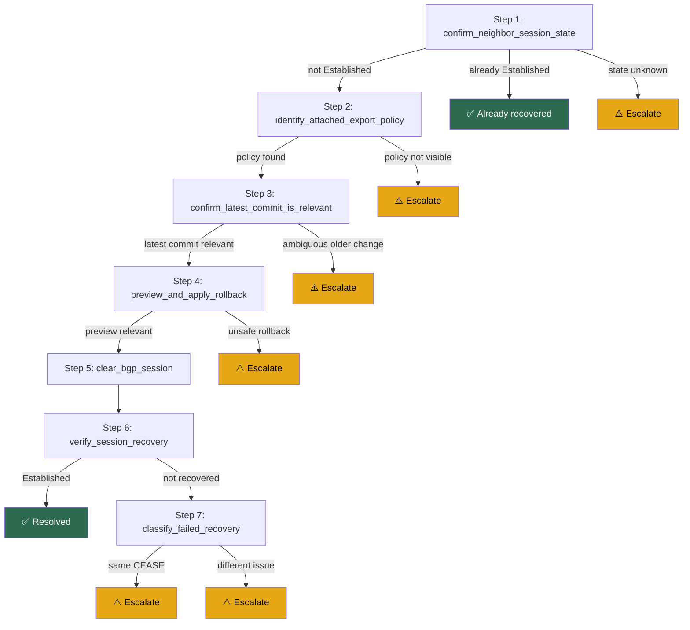

# BGP_NEIGHBOR_MAX_PREFIX_LIMIT_EXCEEDED_REPAIR — Repair Action Workflow Analysis

## Source-to-Step Mapping

| # | Source Procedure / RG Step | RAW Step ID | Step Name | Notes |
|---|---|---|---|---|
| 1 | RG Step 1: confirm whether the alerted neighbor still needs remediation | 1 | `confirm_neighbor_session_state` | Uses the FS/syslog as authoritative max-prefix evidence and checks only current BGP state |
| 2 | RG Step 2: inspect policy attachment and recent config changes | 2 | `identify_attached_export_policy` | Extracts `policy_name` from neighbor state |
| 3 | RG Step 2 / simple rollback path | 3 | `confirm_latest_commit_is_relevant` | Makes the RAW intentionally conservative: only latest-commit rollback is automated |
| 4 | RG Step 3: preview and apply rollback | 4 | `preview_and_apply_rollback` | Uses rollback preview as the safety gate before `rollback configuration last 1` |
| 5 | RG Step 4: clear BGP session | 5 | `clear_bgp_session` | Chooses default or non-default VRF clear command based on `vrf_name` |
| 6 | RG Post-repair verification | 6 | `verify_session_recovery` | Confirms session recovery to `Established` |
| 7 | RG escalation branches | 7 | `classify_failed_recovery` | Distinguishes repeated same CEASE from a different post-rollback adjacency problem |

## Conversion Decisions & Assumptions

1. The RAW is more conservative than the human RG: it only automates rollback of the **latest** clearly relevant commit.
2. Manual policy surgery is intentionally excluded from the RAW and mapped to escalation.
3. The workflow derives `policy_name` from `show bgp neighbors ... | include "Outbound route policy"` rather than from inventory.
4. The post-clear timer is set to **120 seconds** to match the optimized RG default.
5. Evidence collection is attached to `escalate.data.commands[]` instead of using `show` commands in `exec_cli`.
6. Version **1.1.0** relaxes the initial gate: the live IOS XR `Last reset` field is no longer required to show `Maximum Number of Prefixes Reached`, because that field can be overwritten after subsequent BGP reset activity.

## Items Requiring Human Review

1. Confirm that `show bgp neighbors {{ neighbor_ip }} | include "Outbound route policy"` is available and stable across all target IOS XR versions.
2. Confirm that automating `rollback configuration last 1` is acceptable for the intended execution environment when the rollback preview is clearly relevant.
3. If the real-world operational preference is to inspect older commits before escalation, this should remain a human-only path and not be automated here.

## Execution Flow (Mermaid)

## Areas Needing Verification

1. Validate the regex-based commit relevance checks against real IOS XR rollback and commit-diff outputs.
2. Confirm whether the workflow should collect additional BGP evidence before rollback in high-risk production environments.
3. Consider updating the human Remediation Guide Step 1 wording to explicitly state that FS000003/AD000003 provides the max-prefix cause and that `Last reset` is informational only.
